# Sistema de Inventario y Ventas PYME

<p align="center">
  <strong>Sistema web para gestion de inventario y punto de venta dirigido a pequeñas y medianas empresas</strong>
</p>

<p align="center">
  
  
  
  
  
  
</p>

---

## Descripcion

Aplicacion full stack que integra un modulo de punto de venta (POS), control de inventario, gestion de usuarios con roles y un dashboard con indicadores de negocio en tiempo real.

---

## Capturas

### Dashboard
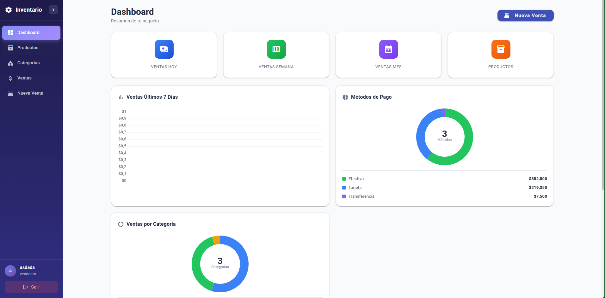

### Punto de Venta
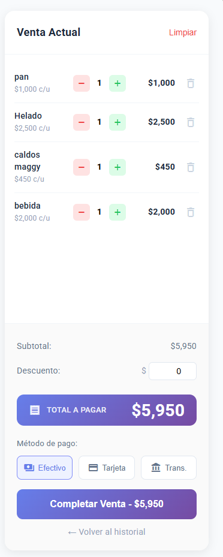

### Inventario
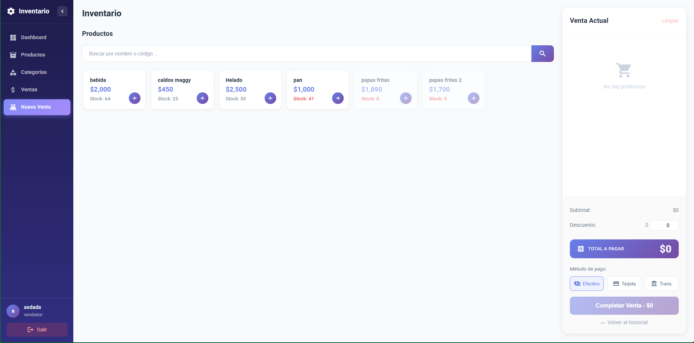

<details>
<summary>Ver mas capturas</summary>

### Productos
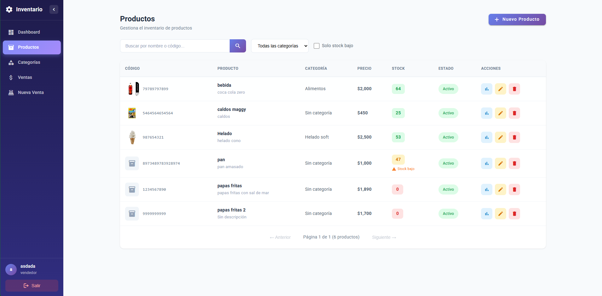

### Nuevo Producto
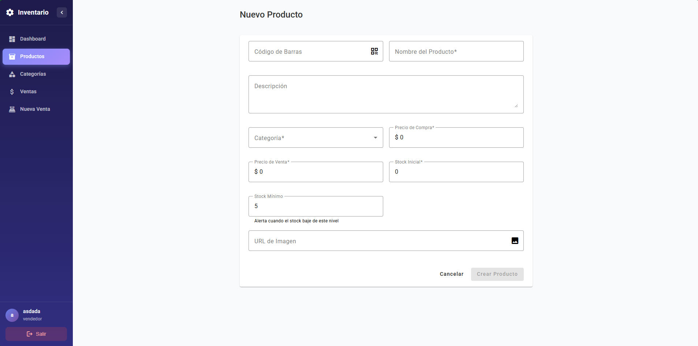

### Historial de Ventas
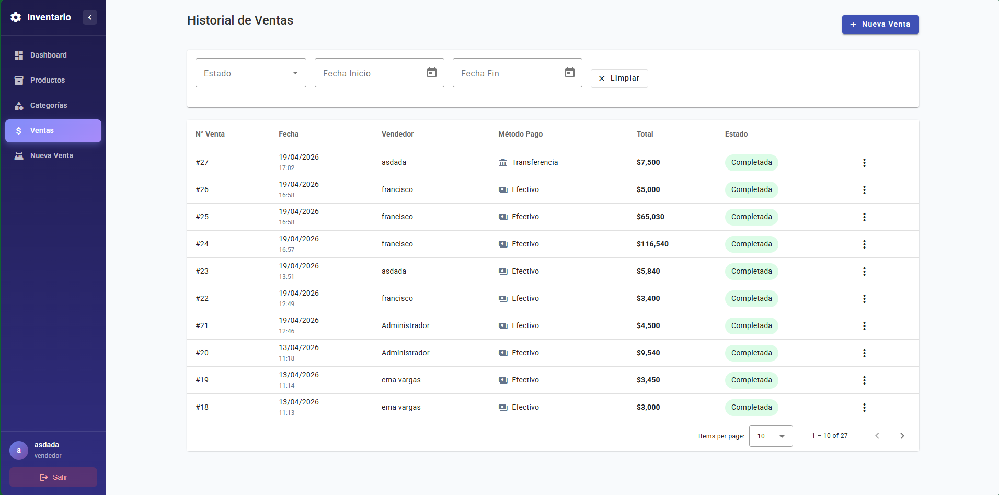

### Filtro Stock Bajo
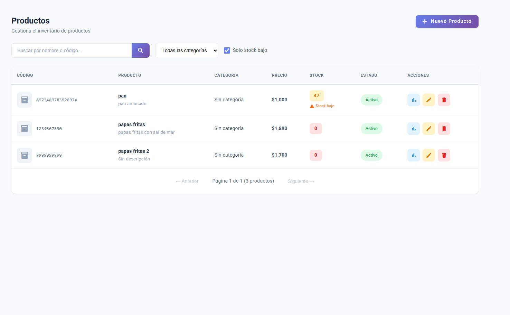

### Categorias
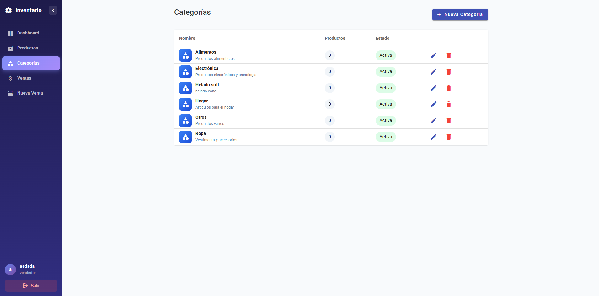

### Nueva Categoria
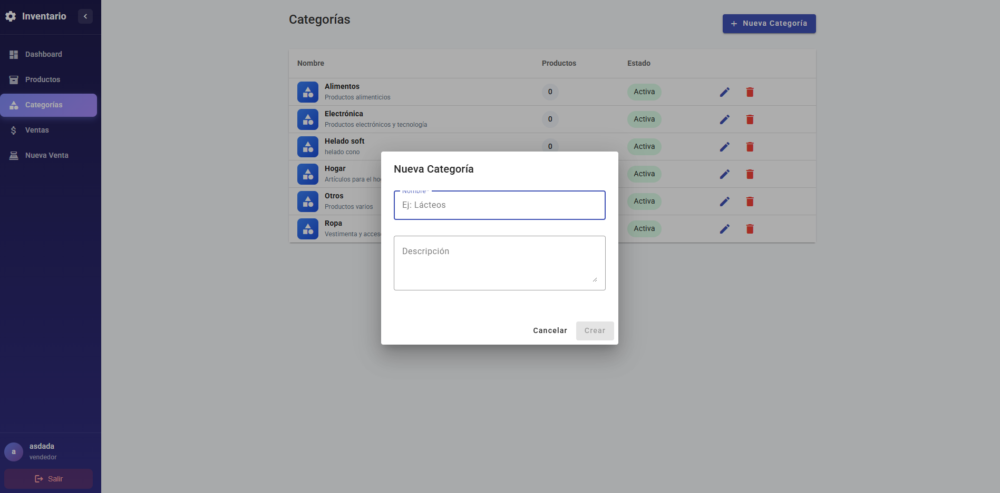

### Autenticacion
<p align="center">
  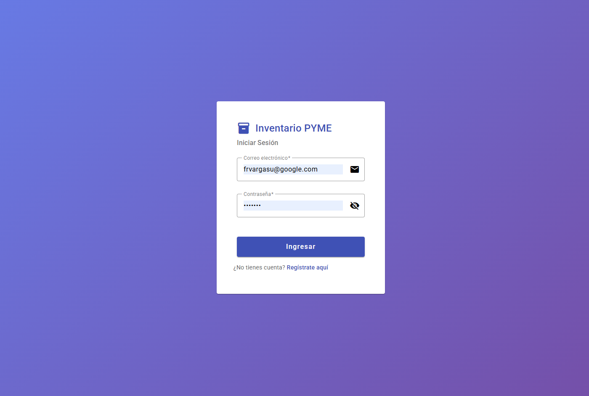
  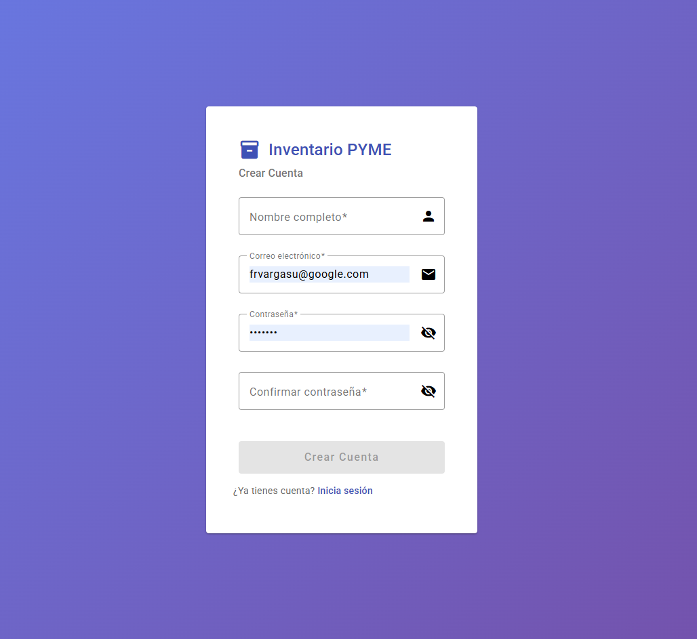
</p>

</details>

---

## Stack Tecnologico

| Capa | Tecnologias |
|------|-------------|
| Frontend | Angular 20, Angular Material, Chart.js |
| Backend | Node.js 20, Express 4, JWT, bcrypt |
| Base de datos | MySQL 8.0 con triggers y transacciones |
| DevOps | Docker, docker-compose, GitHub Actions |
| Testing | Jest, Supertest |
| Seguridad | Helmet, CORS, express-rate-limit |

---

## Instalacion

### Con Docker

```bash
git clone https://github.com/frvargasu/portafolio_duoc.git
cd portafolio_duoc
cp .env.example .env
docker-compose up -d
```

- Frontend: http://localhost:80
- Backend: http://localhost:3000

### Manual

**Requisitos:** Node.js 18+, MySQL 8.0+

```bash
# Backend
cd backend
npm install
cp ../.env.example .env
mysql -u root -p < database/schema.sql
npm run dev
```

```bash
# Frontend
cd frontend
npm install
ng serve
```

### Credenciales de prueba

```
Email:    admin@example.com
Password: Admin123!
```

---

## Arquitectura

Arquitectura de 3 capas con separacion de responsabilidades:

```
Frontend (Angular)
  Components -> Services -> Interceptors -> Guards
        |
      HTTP/REST + JWT
        |
Backend (Express)
  Routes -> Middleware -> Controllers -> Services -> Repositories
        |
       SQL
        |
Database (MySQL)
  Tables + Indexes + Triggers
```

### Estructura del Proyecto

```
backend/
  controllers/    # Manejo de requests HTTP
  services/       # Logica de negocio
  repositories/   # Acceso a datos
  middleware/     # Autenticacion, validacion, rate-limit
  routes/         # Definicion de endpoints
  models/         # Entidades
  database/       # Schema SQL y conexion
  __tests__/      # Tests de integracion

frontend/src/app/
  core/           # Services, guards, interceptors
  modules/
    auth/
    dashboard/
    productos/
    ventas/
    categorias/
    pos/
```

---

## API

Base URL: `http://localhost:3000/api`

| Metodo | Endpoint | Descripcion | Auth |
|--------|----------|-------------|------|
| POST | `/auth/login` | Iniciar sesion | No |
| POST | `/auth/register` | Registrar usuario | No |
| GET | `/productos` | Listar productos | Si |
| POST | `/productos` | Crear producto | Admin |
| PUT | `/productos/:id/stock` | Actualizar stock | Si |
| GET | `/ventas` | Listar ventas | Si |
| POST | `/ventas` | Registrar venta | Si |
| GET | `/reportes/dashboard` | Metricas del dashboard | Si |
| GET | `/reportes/ventas-metodo-pago` | Ventas por metodo de pago | Si |
| GET | `/reportes/ventas-categoria` | Ventas por categoria | Si |

---

## Testing

```bash
cd backend
npm test
npm run test:coverage
```

---

## Variables de Entorno

```env
DB_HOST=localhost
DB_PORT=3306
DB_NAME=inventory_db
DB_USER=root
DB_PASSWORD=

JWT_SECRET=
JWT_EXPIRES_IN=24h

PORT=3000
NODE_ENV=development
```

---

## CI/CD

Pipeline de GitHub Actions que ejecuta tests del backend, compila el frontend, verifica el build de Docker y escanea vulnerabilidades con Trivy.

---

## Autor

**Francisco Vargas**
- GitHub: [@frvargasu](https://github.com/frvargasu)

---

<p align="center">Portafolio de Titulo - DUOC UC</p>
