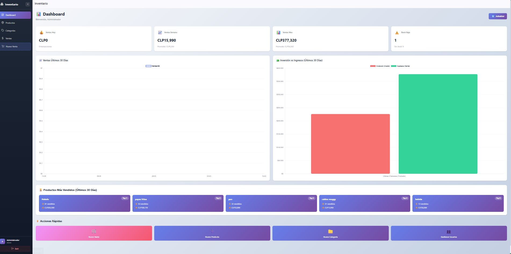
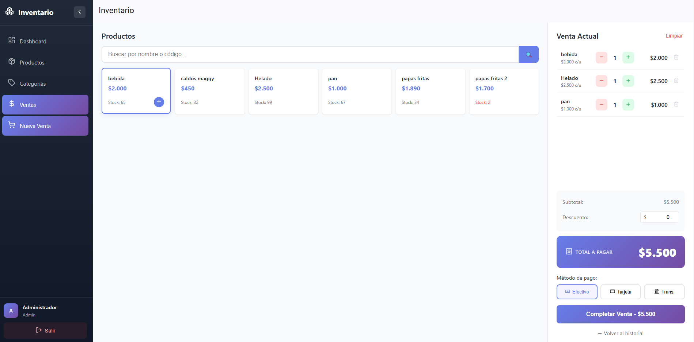
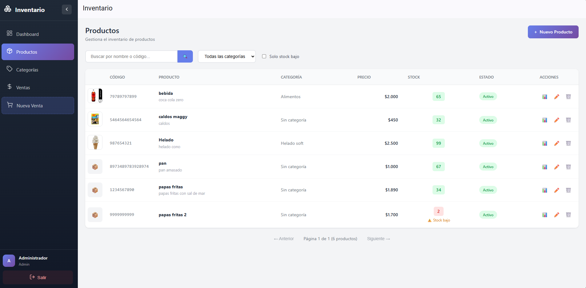
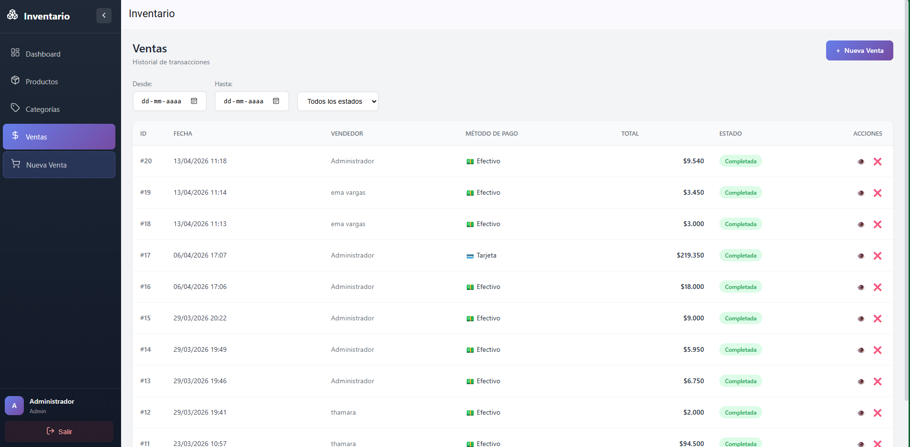
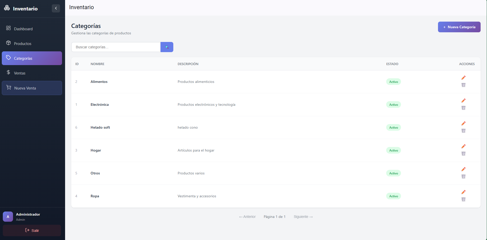
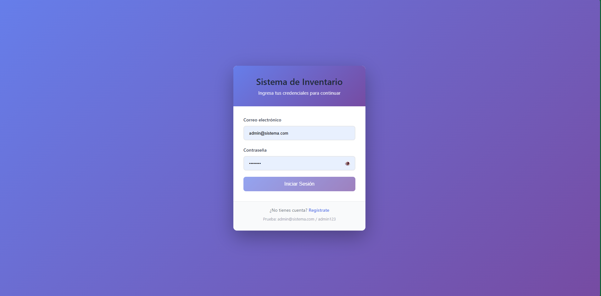
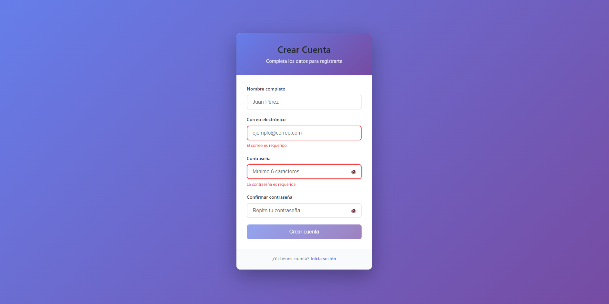

# 🏪 Sistema de Inventario y Ventas PYME

<p align="center">
  <strong>Sistema web completo para gestión de inventario y punto de venta</strong><br>
  Diseñado para pequeñas y medianas empresas
</p>

<p align="center">
  
  
  
  
  
  
</p>

<p align="center">
  <a href="#-características">Características</a> •
  <a href="#-demo">Demo</a> •
  <a href="#-instalación">Instalación</a> •
  <a href="#-arquitectura">Arquitectura</a> •
  <a href="#-api">API</a> •
  <a href="#-documentación">Docs</a>
</p>

---

## 📋 Descripción

Sistema integral de **gestión de inventario y punto de venta (POS)** que permite a pequeños negocios:

- **Controlar inventario** con alertas automáticas de stock bajo
- **Registrar ventas** de forma rápida con interfaz de POS intuitiva
- **Visualizar métricas** en un dashboard con gráficos en tiempo real
- **Gestionar usuarios** con roles diferenciados (admin/vendedor)

### ¿Qué problema resuelve?

Muchas PYMEs en Chile aún manejan su inventario en Excel o papel, perdiendo visibilidad del negocio. Este sistema ofrece una solución moderna, económica y fácil de usar que:

- ✅ Elimina el conteo manual de stock
- ✅ Previene ventas de productos agotados
- ✅ Genera reportes de ventas automáticamente
- ✅ Funciona en cualquier dispositivo con navegador

---

## 🎯 Demo

### Dashboard
Panel con resumen de ventas, gráficos de inversión vs ingresos, y productos más vendidos.



### Punto de Venta
Interfaz optimizada para registrar ventas rápidamente con búsqueda de productos y carrito.



### Gestión de Productos
Catálogo con imágenes, códigos de barras, precios y alertas de inventario.



<details>
<summary><strong>Ver más capturas</strong></summary>

### Historial de Ventas


### Categorías


### Autenticación
<p align="center">
  
  
</p>

</details>

---

## ✨ Características

### 📦 Gestión de Inventario
- Catálogo de productos con imágenes y códigos de barras
- Control de stock con alertas automáticas de inventario bajo
- Historial completo de movimientos (entradas, salidas, ajustes)
- Organización por categorías

### 🛒 Punto de Venta (POS)
- Registro rápido de ventas con carrito de compras
- Búsqueda por nombre o código de barras
- Múltiples métodos de pago (efectivo, tarjeta, transferencia)
- Aplicación de descuentos

### 📊 Dashboard y Reportes
- Resumen de ventas (día, semana, mes)
- Gráficos de inversión vs ingresos (Chart.js)
- Top 5 productos más vendidos
- Alertas de stock bajo

### 🔐 Seguridad
- Autenticación JWT con tokens seguros
- Roles de usuario (admin/vendedor)
- Rate limiting en endpoints sensibles
- Validación de datos en frontend y backend
- Protección contra SQL injection

---

## 🛠️ Stack Tecnológico

| Capa | Tecnologías |
|------|-------------|
| **Frontend** | Angular 20, Angular Material, Chart.js, Lucide Icons |
| **Backend** | Node.js 20, Express 4, JWT, bcrypt |
| **Database** | MySQL 8.0 con triggers y transacciones |
| **DevOps** | Docker, docker-compose, GitHub Actions |
| **Testing** | Jest, Supertest |
| **Seguridad** | Helmet, CORS, express-rate-limit |

---

## 🚀 Instalación

### Opción 1: Docker (Recomendado)

```bash
# 1. Clonar repositorio
git clone https://github.com/frvargasu/portafolio-duoc.git
cd portafolio-duoc

# 2. Copiar variables de entorno
cp .env.example .env

# 3. Levantar servicios
docker-compose up -d

# 4. Acceder
# Frontend: http://localhost:80
# Backend:  http://localhost:3000
```

### Opción 2: Manual

<details>
<summary><strong>Ver instrucciones detalladas</strong></summary>

#### Requisitos
- Node.js 18+
- MySQL 8.0+
- npm o yarn

#### Backend

```bash
# 1. Ir a carpeta backend
cd backend

# 2. Instalar dependencias
npm install

# 3. Configurar variables de entorno
cp ../.env.example .env
# Editar .env con tus credenciales de MySQL

# 4. Crear base de datos
mysql -u root -p < database/schema.sql

# 5. Iniciar servidor
npm run dev
# API disponible en http://localhost:3000
```

#### Frontend

```bash
# 1. Ir a carpeta frontend
cd frontend

# 2. Instalar dependencias
npm install

# 3. Iniciar servidor de desarrollo
ng serve --open
# App disponible en http://localhost:4200
```

</details>

### Usuario de prueba

```
Email: admin@example.com
Password: Admin123!
Rol: Administrador
```

---

## 🏗️ Arquitectura

El sistema sigue una arquitectura de **3 capas** con separación clara de responsabilidades:

```
┌─────────────────────────────────────────────────────────────┐
│                     FRONTEND (Angular)                       │
│        Components → Services → Interceptors → Guards         │
└────────────────────────────┬────────────────────────────────┘
                             │ HTTP/REST + JWT
┌────────────────────────────▼────────────────────────────────┐
│                     BACKEND (Express)                        │
│    Routes → Middleware → Controllers → Services → Repos     │
└────────────────────────────┬────────────────────────────────┘
                             │ SQL + Transactions
┌────────────────────────────▼────────────────────────────────┐
│                      DATABASE (MySQL)                        │
│              Tables + Indexes + Triggers                     │
└─────────────────────────────────────────────────────────────┘
```

### Estructura del Proyecto

```
├── backend/
│   ├── controllers/      # Manejo de HTTP requests
│   ├── services/         # Lógica de negocio
│   ├── repositories/     # Acceso a datos (SQL)
│   ├── middleware/       # Auth, validation, rate-limit
│   ├── routes/           # Definición de endpoints
│   ├── models/           # Entidades de datos
│   ├── database/         # Schema SQL y conexión
│   └── __tests__/        # Tests de integración
│
├── frontend/
│   └── src/app/
│       ├── core/         # Services, guards, interceptors
│       ├── modules/      # Feature modules (lazy loaded)
│       │   ├── auth/     # Login, registro
│       │   ├── dashboard/
│       │   ├── productos/
│       │   ├── ventas/
│       │   ├── categorias/
│       │   └── pos/      # Punto de venta
│       └── shared/       # Componentes compartidos
│
├── docs/                 # Documentación técnica
├── docker-compose.yml    # Orquestación de contenedores
└── .github/workflows/    # CI/CD pipeline
```

📖 Ver [documentación completa de arquitectura](./docs/arquitectura.md)

---

## 🔌 API

Base URL: `http://localhost:3000/api`

### Endpoints Principales

| Método | Endpoint | Descripción | Auth |
|--------|----------|-------------|------|
| `POST` | `/auth/login` | Iniciar sesión | ❌ |
| `POST` | `/auth/register` | Registrar usuario | ❌ |
| `GET` | `/productos` | Listar productos | ✅ |
| `GET` | `/productos/barcode/:codigo` | Buscar por código | ✅ |
| `POST` | `/productos` | Crear producto | ✅ Admin |
| `PUT` | `/productos/:id/stock` | Actualizar stock | ✅ |
| `GET` | `/ventas` | Listar ventas | ✅ |
| `POST` | `/ventas` | Registrar venta | ✅ |
| `GET` | `/reportes/dashboard` | Datos del dashboard | ✅ |

### Ejemplo de Request

```bash
# Login
curl -X POST http://localhost:3000/api/auth/login \
  -H "Content-Type: application/json" \
  -d '{"email": "admin@example.com", "password": "Admin123!"}'

# Respuesta
{
  "success": true,
  "data": {
    "user": { "id": 1, "nombre": "Admin", "rol": "admin" },
    "token": "eyJhbGciOiJIUzI1NiIs..."
  }
}
```

📖 Ver [documentación completa de API](./docs/api.md)

---

## 📚 Documentación

| Documento | Descripción |
|-----------|-------------|
| [Arquitectura](./docs/arquitectura.md) | Explicación de capas y componentes |
| [Base de Datos](./docs/database.md) | Modelo de datos, triggers, relaciones |
| [API Reference](./docs/api.md) | Endpoints, requests, responses |
| [Decisiones Técnicas](./docs/decisions.md) | Por qué se eligió cada tecnología |

### Diagramas

- [Diagrama de Arquitectura](./docs/diagrams/arquitectura.md) (Mermaid)
- [Diagrama de Base de Datos](./docs/diagrams/database.md) (Mermaid)
- [Diagramas de Secuencia](./docs/diagrams/secuencia.md) (Mermaid)

---

## 🧪 Testing

```bash
# Ejecutar tests del backend
cd backend
npm test

# Con coverage
npm run test:coverage
```

Los tests incluyen:
- Autenticación (login, registro)
- CRUD de productos
- Registro de ventas
- Validación de stock

---

## 🔧 Variables de Entorno

Copiar `.env.example` a `.env` y configurar:

```env
# Base de datos
DB_HOST=localhost
DB_PORT=3306
DB_NAME=inventory_db
DB_USER=root
DB_PASSWORD=tu_password

# JWT
JWT_SECRET=tu_clave_secreta_muy_larga
JWT_EXPIRES_IN=24h

# Server
PORT=3000
NODE_ENV=development
```

---

## 📈 CI/CD

El proyecto incluye pipeline de GitHub Actions que:

1. ✅ Ejecuta tests del backend
2. ✅ Compila el frontend Angular
3. ✅ Verifica build de Docker
4. ✅ Escanea vulnerabilidades con Trivy

---

## 🤝 Contribuir

1. Fork el repositorio
2. Crear rama feature (`git checkout -b feature/nueva-funcionalidad`)
3. Commit cambios (`git commit -m 'feat: agregar nueva funcionalidad'`)
4. Push a la rama (`git push origin feature/nueva-funcionalidad`)
5. Abrir Pull Request

---

## 📄 Licencia

Este proyecto está bajo la Licencia MIT. Ver [LICENSE](LICENSE) para más detalles.

---

## 👤 Autor

**Felipe Vargas**

- GitHub: [@frvargasu](https://github.com/frvargasu)
- LinkedIn: [Felipe Vargas](https://linkedin.com/in/frvargasu)

---

<p align="center">
  Hecho con ❤️ para el portafolio de DUOC UC
</p>
 # Sistema de Inventario y Ventas PYME

Sistema web completo para gestión de inventario y punto de venta, diseñado para pequeñas y medianas empresas chilenas.


---

## Screenshots

### Dashboard
Panel principal con resumen de ventas, gráficos de inversión vs ingresos, productos más vendidos y accesos rápidos.


### Punto de Venta
Interfaz intuitiva para registrar ventas rápidamente con carrito de compras, búsqueda de productos y múltiples métodos de pago.


### Gestión de Productos
Catálogo completo con imágenes, códigos de barras, precios, stock y alertas de inventario bajo.


### Historial de Ventas
Registro detallado de todas las transacciones con filtros por fecha, estado y método de pago.


### Categorías
Organización de productos por categorías para facilitar la gestión del inventario.


### Autenticación
Sistema seguro de login y registro con validación de formularios.

<p align="center">
  
  
</p>

---

## Características

### Gestión de Inventario
- ✅ Catálogo de productos con imágenes y códigos de barras
- ✅ Control de stock con alertas de inventario bajo
- ✅ Historial de movimientos (entradas, salidas, ajustes)
- ✅ Categorización de productos

### Punto de Venta
- ✅ Registro rápido de ventas con carrito
- ✅ Múltiples métodos de pago (efectivo, tarjeta, transferencia)
- ✅ Aplicación de descuentos
- ✅ Historial de transacciones con filtros

### Dashboard y Reportes
- ✅ Resumen de ventas (hoy, semana, mes)
- ✅ Gráficos de inversión vs ingresos
- ✅ Top 5 productos más vendidos
- ✅ Alertas de stock bajo

### Seguridad
- ✅ Autenticación JWT
- ✅ Roles de usuario (admin/vendedor)
- ✅ Protección de rutas
- ✅ Validación de datos

---

## Tecnologías

| Backend | Frontend |
|---------|----------|
| Node.js + Express | Angular 20 |
| MySQL | Angular Material |
| JWT + bcrypt | Chart.js |
| Helmet, CORS | Lucide Icons |

---

## Requisitos

- Node.js 18+
- MySQL 8.0+
- npm o yarn

---

## Instalación

### 1. Clonar repositorio

```bash
git clone https://github.com/frvargasu/portafolio-duoc.git
cd portafolio-duoc
```

### 2. Backend

```bash
cd backend
npm install
cp .env.example .env  # Configurar variables de entorno
npm run init-db       # Crear base de datos y tablas
npm run dev           # Iniciar servidor en modo desarrollo
```

### 3. Frontend

```bash
cd frontend
npm install
npm start
```

### 4. Acceder

| Servicio | URL |
|----------|-----|
| Frontend | http://localhost:4200 |
| API | http://localhost:3000 |

---

##  Usuario por Defecto

| Email | Contraseña | Rol |
|-------|------------|-----|
| admin@sistema.com | admin123 | Administrador |

---

## Estructura del Proyecto

```
├── backend/
│   ├── config/          # Configuración de la app
│   ├── controllers/     # Controladores de rutas
│   ├── database/        # Conexión y schema SQL
│   ├── middleware/      # Auth, validación, errores
│   ├── models/          # Modelos de datos
│   ├── repositories/    # Acceso a base de datos
│   ├── routes/          # Definición de endpoints
│   ├── services/        # Lógica de negocio
│   └── app.js           # Punto de entrada
│
└── frontend/
    └── src/app/
        ├── core/        # Guards, interceptores, servicios
        ├── layout/      # Sidebar, header
        ├── modules/     # Módulos funcionales
        │   ├── auth/
        │   ├── dashboard/
        │   ├── productos/
        │   ├── categorias/
        │   └── ventas/
        └── shared/      # Componentes reutilizables
```

---

## API Endpoints

### Autenticación
| Método | Endpoint | Descripción |
|--------|----------|-------------|
| POST | `/api/auth/login` | Iniciar sesión |
| POST | `/api/auth/register` | Registrar usuario |
| GET | `/api/auth/profile` | Obtener perfil |

### Productos
| Método | Endpoint | Descripción |
|--------|----------|-------------|
| GET | `/api/productos` | Listar productos |
| GET | `/api/productos/:id` | Obtener producto |
| POST | `/api/productos` | Crear producto |
| PUT | `/api/productos/:id` | Actualizar producto |
| DELETE | `/api/productos/:id` | Eliminar producto |

### Ventas
| Método | Endpoint | Descripción |
|--------|----------|-------------|
| GET | `/api/ventas` | Listar ventas |
| GET | `/api/ventas/:id` | Obtener detalle |
| POST | `/api/ventas` | Registrar venta |
| PUT | `/api/ventas/:id/cancelar` | Cancelar venta |

### Categorías
| Método | Endpoint | Descripción |
|--------|----------|-------------|
| GET | `/api/categorias` | Listar categorías |
| POST | `/api/categorias` | Crear categoría |
| PUT | `/api/categorias/:id` | Actualizar |
| DELETE | `/api/categorias/:id` | Eliminar |

### Reportes
| Método | Endpoint | Descripción |
|--------|----------|-------------|
| GET | `/api/reportes/dashboard` | Datos del dashboard |
| GET | `/api/reportes/ventas` | Reporte de ventas |
| GET | `/api/reportes/inventario` | Reporte de inventario |

---

##  Base de Datos

### Diagrama de Tablas

```
usuarios ──────┐
               │
categorias ────┼──> productos ──> detalle_ventas ──> ventas
               │         │
               │         └──> movimientos_stock
               │
               └────────────────────────────────────────┘
```

### Tablas Principales
- **usuarios**: Administradores y vendedores
- **productos**: Catálogo con stock y precios
- **categorias**: Clasificación de productos
- **ventas**: Registro de transacciones
- **detalle_ventas**: Productos por venta
- **movimientos_stock**: Historial de inventario

---

##  Contexto del Proyecto

### Visión y Pilares


### Problema
Las PYMES enfrentan dificultades en el control manual de inventario y ventas, lo que genera:
- Falta de stock por desconocimiento de existencias
- Errores en el registro de ventas
- Mala gestión financiera
- Pérdidas económicas


### Solución
Sistema web que automatiza:
- Control de inventario en tiempo real
- Registro de ventas con múltiples métodos de pago
- Reportes y estadísticas para toma de decisiones
- Alertas de stock bajo

### Stakeholders


- **Principal**: Dueño PYME, Administrador
- **Secundario**: Vendedor, Empleados
- **Informado**: Clientes

---

## Licencia

MIT License

---

## Autor

**Francisco Vargas** - [GitHub](https://github.com/