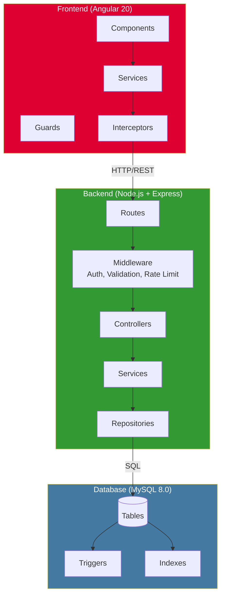
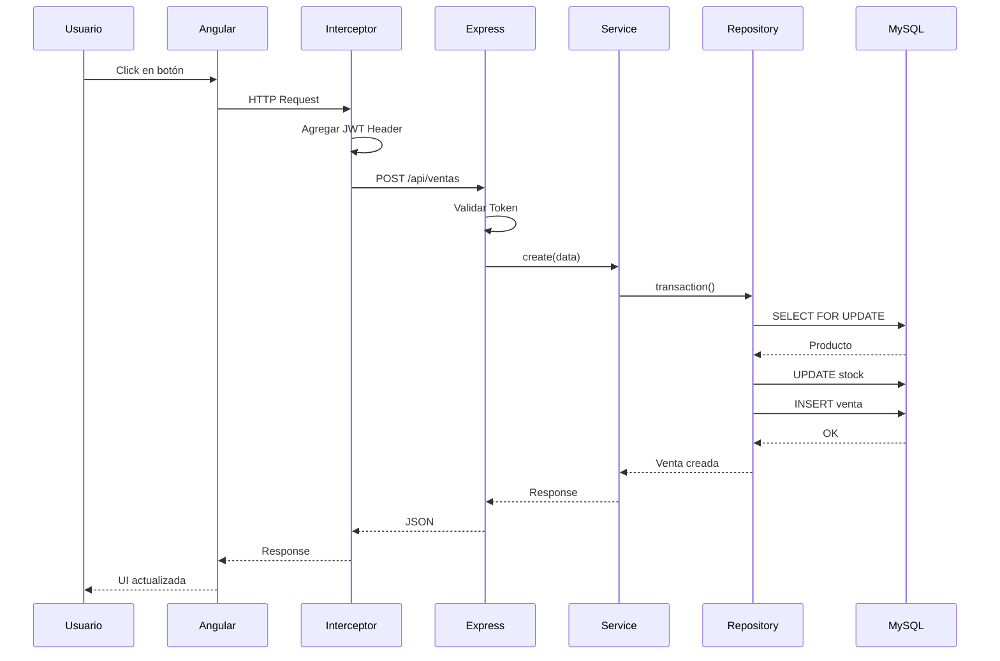

# Diagrama de Arquitectura

```mermaid
flowchart TB
    subgraph Frontend["Frontend (Angular 20)"]
        UI[Components]
        Services[Services]
        Guards[Guards]
        Interceptors[Interceptors]
    end

    subgraph Backend["Backend (Node.js + Express)"]
        Routes[Routes]
        Middleware[Middleware<br/>Auth, Validation, Rate Limit]
        Controllers[Controllers]
        ServicesB[Services]
        Repositories[Repositories]
    end

    subgraph Database["Database (MySQL 8.0)"]
        Tables[(Tables)]
        Triggers[Triggers]
        Indexes[Indexes]
    end

    UI --> Services
    Services --> Interceptors
    Interceptors -->|HTTP/REST| Routes
    
    Routes --> Middleware
    Middleware --> Controllers
    Controllers --> ServicesB
    ServicesB --> Repositories
    Repositories -->|SQL| Tables
    
    Tables --> Triggers
    Tables --> Indexes

    style Frontend fill:#DD0031,color:#fff
    style Backend fill:#339933,color:#fff
    style Database fill:#4479A1,color:#fff
```

## Flujo de Request

```mermaid
sequenceDiagram
    participant U as Usuario
    participant A as Angular
    participant I as Interceptor
    participant E as Express
    participant S as Service
    participant R as Repository
    participant D as MySQL

    U->>A: Click en botón
    A->>I: HTTP Request
    I->>I: Agregar JWT Header
    I->>E: POST /api/ventas
    E->>E: Validar Token
    E->>S: create(data)
    S->>R: transaction()
    R->>D: SELECT FOR UPDATE
    D-->>R: Producto
    R->>D: UPDATE stock
    R->>D: INSERT venta
    D-->>R: OK
    R-->>S: Venta creada
    S-->>E: Response
    E-->>I: JSON
    I-->>A: Response
    A-->>U: UI actualizada
```
