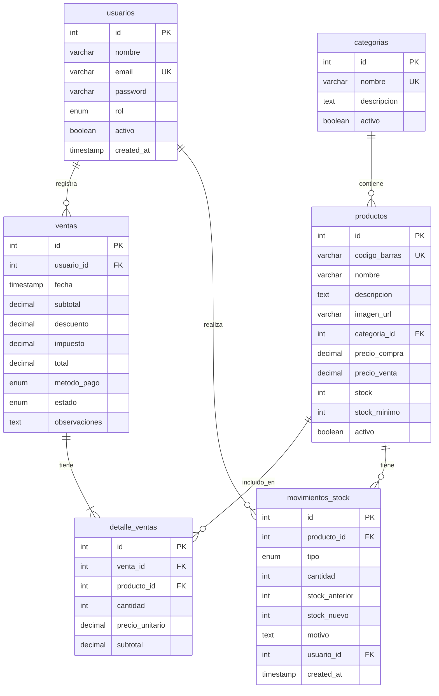

# Diagrama de Base de Datos

## Relaciones

| Tabla Origen | Relación | Tabla Destino | Descripción |
|--------------|----------|---------------|-------------|
| usuarios | 1:N | ventas | Un usuario registra muchas ventas |
| categorias | 1:N | productos | Una categoría tiene muchos productos |
| productos | 1:N | detalle_ventas | Un producto aparece en muchas ventas |
| ventas | 1:N | detalle_ventas | Una venta tiene muchos productos |
| productos | 1:N | movimientos_stock | Un producto tiene historial de movimientos |
