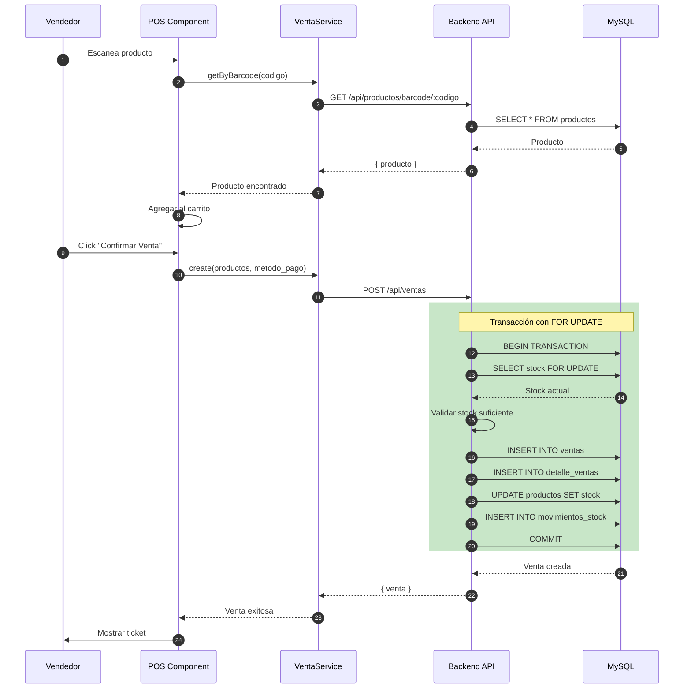
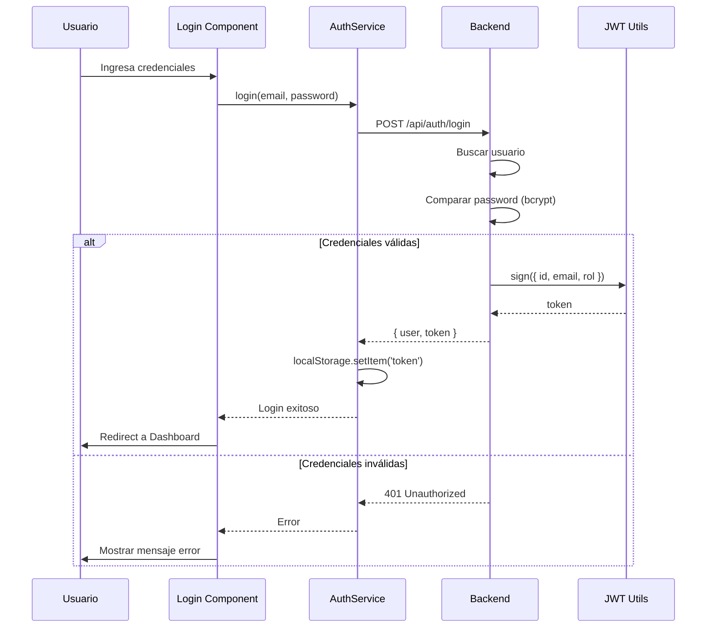
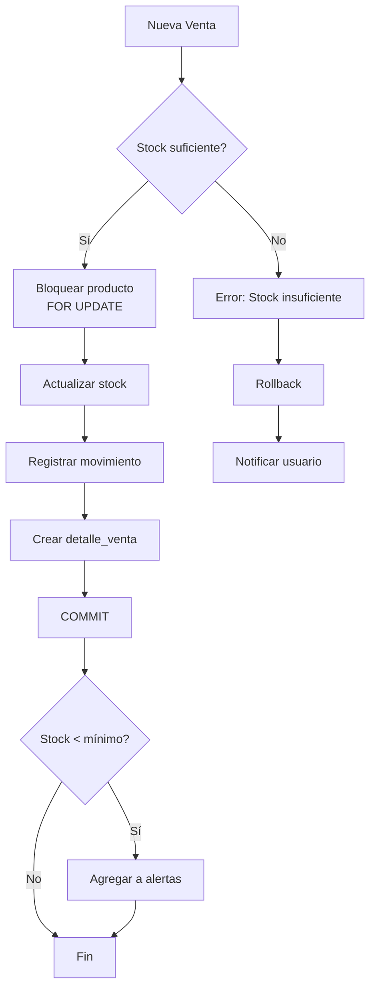

# Diagrama de Secuencia - Flujo de Venta

```mermaid
sequenceDiagram
    autonumber
    participant V as Vendedor
    participant POS as POS Component
    participant VS as VentaService
    participant API as Backend API
    participant DB as MySQL

    V->>POS: Escanea producto
    POS->>VS: getByBarcode(codigo)
    VS->>API: GET /api/productos/barcode/:codigo
    API->>DB: SELECT * FROM productos
    DB-->>API: Producto
    API-->>VS: { producto }
    VS-->>POS: Producto encontrado
    POS->>POS: Agregar al carrito

    V->>POS: Click "Confirmar Venta"
    POS->>VS: create(productos, metodo_pago)
    VS->>API: POST /api/ventas
    
    rect rgb(200, 230, 200)
        Note over API,DB: Transacción con FOR UPDATE
        API->>DB: BEGIN TRANSACTION
        API->>DB: SELECT stock FOR UPDATE
        DB-->>API: Stock actual
        API->>API: Validar stock suficiente
        API->>DB: INSERT INTO ventas
        API->>DB: INSERT INTO detalle_ventas
        API->>DB: UPDATE productos SET stock
        API->>DB: INSERT INTO movimientos_stock
        API->>DB: COMMIT
    end

    DB-->>API: Venta creada
    API-->>VS: { venta }
    VS-->>POS: Venta exitosa
    POS->>V: Mostrar ticket
```

## Flujo de Autenticación

```mermaid
sequenceDiagram
    participant U as Usuario
    participant L as Login Component
    participant AS as AuthService
    participant API as Backend
    participant JWT as JWT Utils

    U->>L: Ingresa credenciales
    L->>AS: login(email, password)
    AS->>API: POST /api/auth/login
    API->>API: Buscar usuario
    API->>API: Comparar password (bcrypt)
    
    alt Credenciales válidas
        API->>JWT: sign({ id, email, rol })
        JWT-->>API: token
        API-->>AS: { user, token }
        AS->>AS: localStorage.setItem('token')
        AS-->>L: Login exitoso
        L->>U: Redirect a Dashboard
    else Credenciales inválidas
        API-->>AS: 401 Unauthorized
        AS-->>L: Error
        L->>U: Mostrar mensaje error
    end
```

## Flujo de Control de Stock

```mermaid
flowchart TD
    A[Nueva Venta] --> B{Stock suficiente?}
    B -->|Sí| C[Bloquear producto<br/>FOR UPDATE]
    B -->|No| D[Error: Stock insuficiente]
    
    C --> E[Actualizar stock]
    E --> F[Registrar movimiento]
    F --> G[Crear detalle_venta]
    G --> H[COMMIT]
    
    H --> I{Stock < mínimo?}
    I -->|Sí| J[Agregar a alertas]
    I -->|No| K[Fin]
    J --> K
    
    D --> L[Rollback]
    L --> M[Notificar usuario]
```
